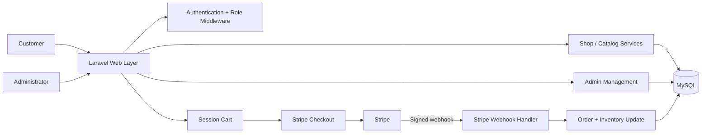
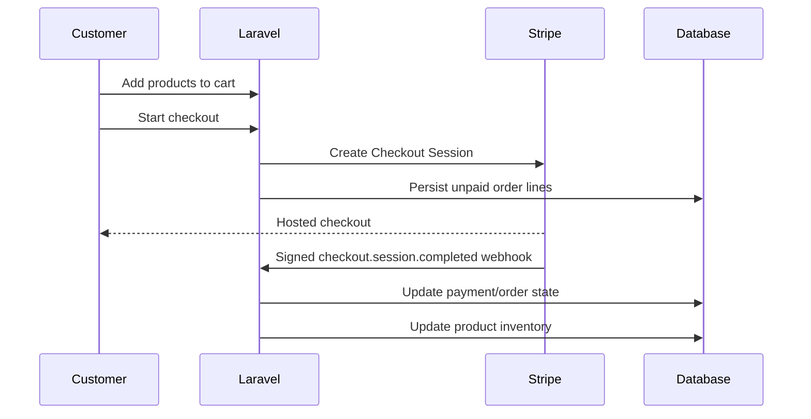

# Boldinone — Laravel E-Commerce Platform

A full Laravel commerce application with customer shopping flows, an administration area, role-based access, Stripe Checkout, product/catalog management, orders, wishlists, reviews, promotions and responsive frontend tooling.

This repository is one of my larger public Laravel projects and is presented as a practical example of building and extending an existing business application beyond basic CRUD.

## Why this project matters

Boldinone brings several real application concerns together in one codebase:

- customer authentication and account flows
- product browsing and catalog management
- session-based shopping cart
- Stripe Checkout integration and signed Stripe webhooks
- order persistence and payment-state updates
- inventory changes after successful payment
- admin-only management routes
- roles and permissions
- categories, featured products, deals and promotional content
- wishlist and product-review workflows
- AJAX-style product search
- Vite/Tailwind/Alpine frontend tooling

## Technology stack

| Layer | Technology |
|---|---|
| Backend | PHP 8.1+, Laravel 10 |
| Authentication | Laravel Breeze / Sanctum |
| Database | MySQL-compatible relational database |
| Payments | Stripe Checkout + webhook verification |
| Frontend | Blade, Tailwind CSS, Alpine.js, JavaScript |
| Assets | Vite |
| Testing | PHPUnit |

## High-level architecture



More detail is available in [`docs/ARCHITECTURE.md`](docs/ARCHITECTURE.md).

## Main application areas

### Customer commerce flow

Customers can browse products, search the catalog, maintain a session cart, update quantities, remove items, maintain a wishlist, submit reviews and proceed to Stripe Checkout.

Typical flow:



### Administration

The route structure contains a dedicated admin area protected by authentication and role middleware. Administrative workflows include management of:

- products
- orders
- categories
- roles
- permissions
- users/invitations
- slides/promotional content
- advertisements
- settings
- plans
- product deals

### Product merchandising

The storefront supports multiple merchandising concepts rather than a single flat product list, including featured products, featured categories, discounted products, trending products, selected menu categories and time-bound deals.

### Payments

Stripe is configured through environment variables and the payment flow includes:

- Checkout Session creation
- customer email handoff
- success/cancel handling
- signed webhook verification
- `checkout.session.completed` processing
- Stripe balance event handling

See [`docs/SECURITY.md`](docs/SECURITY.md) for payment and secret-handling guidance.

## Selected implementation examples

### Role-protected administration

```php
Route::middleware(['auth', 'role:admin'])
    ->name('admin.')
    ->prefix('/admin')
    ->group(function () {
        Route::resource('/roles', RoleController::class);
        Route::resource('/permissions', PermissionController::class);
        Route::resource('/products', ProductController::class);
        Route::resource('/orders', OrderController::class);
    });
```

### Stripe configuration

```php
return [
    'pk' => env('STRIPE_KEY'),
    'sk' => env('STRIPE_SECRET'),
];
```

Secrets stay outside source control and are supplied through the environment.

## Local setup

### Requirements

- PHP 8.1+
- Composer
- MySQL / MariaDB
- Node.js + npm
- Stripe test account for payment testing

### Install

```bash
git clone https://github.com/DagemawiDeveloper/Boldinone.git
cd Boldinone
composer install
npm install
cp .env.example .env
php artisan key:generate
```

Configure the database and Stripe test values in `.env`, then run:

```bash
php artisan migrate
npm run build
php artisan serve
```

For local frontend development:

```bash
npm run dev
```

## Stripe environment values

```dotenv
STRIPE_KEY=pk_test_...
STRIPE_SECRET=sk_test_...
STRIPE_WEBHOOK_KEY=whsec_...
```

Never commit real payment credentials.

## Repository quality checks

The repository includes a lightweight GitHub Actions workflow that validates Composer metadata and checks PHP syntax on pushes and pull requests. This keeps the public project verifiable without requiring production credentials or an external database.

## Current engineering focus

This project represents a substantial Laravel application and is also useful as a code-review/debugging example. The next hardening layer for a production deployment would focus on expanding automated test coverage around checkout, webhook idempotency, inventory updates and authorization boundaries.

That distinction is intentional: a public portfolio should show not only what a system does, but also awareness of what should be tested and hardened before high-volume production use.

## Related showcases

- [RelayHub — Laravel API & Webhook Integration Service](https://github.com/DagemawiDeveloper/laravel-api-integration-demo)
- [WP Integration Toolkit](https://github.com/DagemawiDeveloper/wordpress-plugin-development-demo)
- [SaaS Architecture Showcase](https://github.com/DagemawiDeveloper/saas-architecture-showcase)

## Author

**Dagemawi Alemayehu**  
PHP · Laravel · WordPress · MySQL · REST APIs · SaaS · Flutter

[Upwork Profile](https://www.upwork.com/freelancers/dagemawialemayehu) · [GitHub Profile](https://github.com/DagemawiDeveloper)
