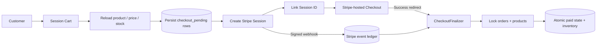
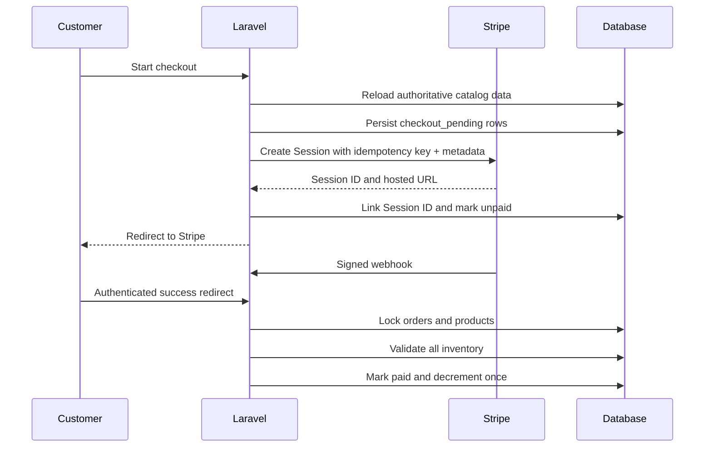

# Boldinone — Laravel Commerce and Payment Reliability Reference

[](https://github.com/DagemawiDeveloper/Boldinone/actions/workflows/quality.yml)

A Laravel 12 commerce application with customer shopping flows, role-protected administration, Stripe Checkout, recoverable local payment state, idempotent webhook processing, inventory protection, and automated tests.

Boldinone is presented as an engineering portfolio project: the storefront is useful, but the most important part of the repository is how it handles the failure-prone boundary between an external payment provider and local business state.

## Engineering focus

The payment implementation answers practical questions that basic Checkout examples usually leave unresolved:

- What happens if Stripe is unavailable?
- What happens if the database update after Stripe succeeds is interrupted?
- What happens when Stripe retries the same event?
- What happens when the browser success request races the webhook?
- What happens if one paid item no longer has sufficient inventory?
- How can an operator distinguish a processed event from a failed reconciliation?

## Technology

| Layer | Technology |
|---|---|
| Backend | PHP 8.2+, Laravel 12 |
| Authentication | Laravel Breeze / Sanctum |
| Database | MySQL, MariaDB, PostgreSQL, or SQLite through Eloquent |
| Payments | Stripe-hosted Checkout and signed webhooks |
| Frontend | Blade, Tailwind CSS, Alpine.js, JavaScript, Vite |
| Testing | PHPUnit 11, Laravel HTTP tests, in-memory SQLite |
| CI | GitHub Actions on PHP 8.2, 8.3, and 8.4 |

## Application capabilities

- customer registration, authentication, and account flows;
- product browsing, category filtering, search, wishlist, and reviews;
- session-based cart with database-authoritative checkout values;
- Stripe Checkout;
- order and inventory management;
- roles and permissions;
- administration for products, orders, users, categories, plans, promotions, and settings;
- responsive Blade/Tailwind interface.

## Durable checkout architecture



### 1. The cart is not trusted for money

The session contains product IDs and requested quantities for the customer experience. Before Stripe is called, every product is reloaded from the database and the server-side product name, price, availability, and stock determine the Checkout request.

### 2. Local state exists before the external request

The application generates an internal `checkout_reference` and persists local `checkout_pending` rows inside a transaction before creating a Stripe Session.

Stripe receives:

- the customer ID in metadata;
- the internal checkout reference in metadata and `client_reference_id`;
- a stable idempotency key based on the checkout reference.

If Stripe creation fails, the local rows become `checkout_failed` rather than disappearing.

### 3. Interrupted linking is recoverable

The Stripe Session ID is normally attached to the local rows immediately. If that local update is interrupted after Stripe succeeds, the success request or webhook can recover the pending rows using `checkout_reference` from Stripe metadata and attach the real Session ID.

### 4. Webhook delivery is auditable

`stripe_webhook_events` records each Stripe event by unique event ID, event type, Checkout Session ID, status, bounded error text, and processed timestamp.

A processed event is duplicate-safe. A failed local reconciliation remains visible and returns a non-2xx response so Stripe can retry it.

### 5. Finalization is atomic and repeatable

`CheckoutFinalizer`:

1. locks all matching order rows;
2. ignores rows already paid;
3. aggregates quantity by product;
4. locks affected products in deterministic order;
5. verifies every product and every inventory requirement;
6. decrements inventory and marks all order rows paid in one transaction.

No inventory changes occur until every item passes validation. A missing or insufficient product rolls back the whole checkout instead of leaving a partially finalized paid order.

## Payment sequence



See [`docs/PAYMENT-FLOW.md`](docs/PAYMENT-FLOW.md) for the complete lifecycle.

## Test coverage

The focused payment tests verify:

- local checkout rows exist before the Stripe SDK is called;
- a manipulated cart price is ignored;
- failed remote Checkout creation leaves auditable local state;
- successful multi-line finalization;
- duplicate finalization does not decrement inventory twice;
- recovery through `checkout_reference`;
- missing local checkout detection;
- full rollback when any product has insufficient stock;
- first-time Stripe event processing;
- duplicate Stripe event suppression;
- failed reconciliation ledger state;
- unpaid Checkout events do not change inventory.

The repository also retains its authentication and profile feature tests.

## Continuous integration

GitHub Actions runs on PHP 8.2, 8.3, and 8.4 and performs:

1. strict Composer metadata validation;
2. supported dependency resolution;
3. dependency security auditing;
4. a clean `migrate:fresh` against SQLite;
5. PHP syntax linting;
6. the full PHPUnit suite;
7. a tracked-file scan for obvious live Stripe secrets and private-key blocks.

JUnit output, dependency logs, and the PHP 8.2 resolved lock file are uploaded as workflow artifacts.

## Local setup

Requirements:

- PHP 8.2+
- Composer 2
- a supported database;
- Node.js and npm for frontend assets;
- a Stripe test account for payment testing.

```bash
git clone https://github.com/DagemawiDeveloper/Boldinone.git
cd Boldinone
composer install
npm install
cp .env.example .env
php artisan key:generate
```

Configure the database and Stripe test values, then run:

```bash
php artisan migrate
npm run build
php artisan serve
```

Run quality checks:

```bash
composer lint
composer test
```

## Stripe environment values

```dotenv
STRIPE_KEY=pk_test_...
STRIPE_SECRET=sk_test_...
STRIPE_WEBHOOK_SECRET=whsec_...
```

Use test values locally. Never commit real payment credentials.

## Documentation

- [`docs/PAYMENT-FLOW.md`](docs/PAYMENT-FLOW.md) — checkout, recovery, event ledger, and finalization
- [`docs/SECURITY.md`](docs/SECURITY.md) — security boundaries and operational guidance
- [`docs/ARCHITECTURE.md`](docs/ARCHITECTURE.md) — broader application structure

## Scope

This repository is an engineering reference, not a claim that a payment system is finished merely because tests pass. A real deployment should also add alerting, scheduled Stripe reconciliation, backups, retention policies, structured redacted logging, provider API-version governance, and workload-specific authorization reviews.

## License

MIT License. See [`LICENSE`](LICENSE).

## Author

**Dagemawi Alemayehu**  
PHP · Laravel · WordPress · MySQL · REST APIs · SaaS · Flutter

[Upwork Profile](https://www.upwork.com/freelancers/dagemawialemayehu) · [GitHub Profile](https://github.com/DagemawiDeveloper)
