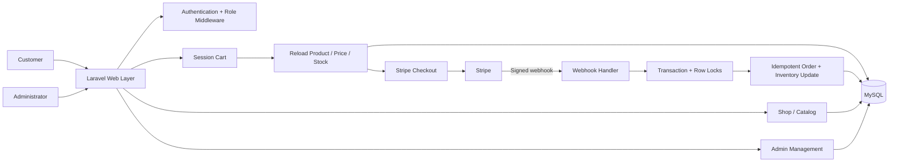
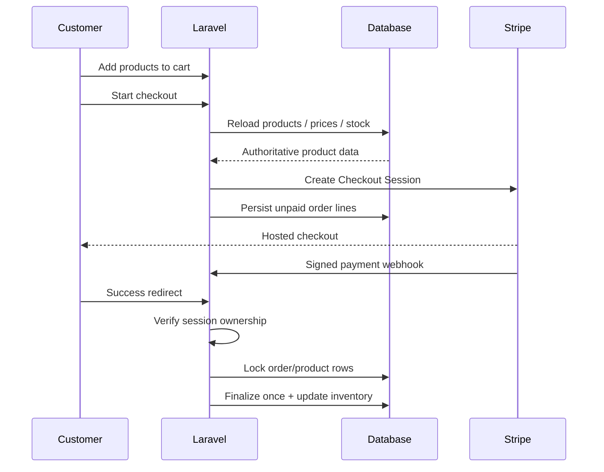

# Boldinone — Laravel E-Commerce Platform

[](https://github.com/DagemawiDeveloper/Boldinone/actions/workflows/quality.yml)

A full Laravel commerce application with customer shopping flows, an administration area, role-based access, Stripe Checkout, product/catalog management, orders, wishlists, reviews, promotions and responsive frontend tooling.

This repository is one of my larger public Laravel projects and is presented as a practical example of building, debugging and hardening an existing business application beyond basic CRUD.

## Why this project matters

Boldinone brings several real application concerns together in one codebase:

- customer authentication and account flows
- product browsing and catalog management
- session-based shopping cart
- server-authoritative checkout pricing
- Stripe Checkout integration and signed Stripe webhooks
- retry-safe/idempotent payment finalization
- transaction + row-lock protection around order/inventory updates
- checkout-session ownership verification
- admin-only management routes
- roles and permissions
- categories, featured products, deals and promotional content
- wishlist and product-review workflows
- AJAX-style product search
- Vite/Tailwind/Alpine frontend tooling

## Technology stack

| Layer | Technology |
|---|---|
| Backend | PHP 8.1+, Laravel 10 |
| Authentication | Laravel Breeze / Sanctum |
| Database | MySQL-compatible relational database |
| Payments | Stripe Checkout + signed webhooks |
| Frontend | Blade, Tailwind CSS, Alpine.js, JavaScript |
| Assets | Vite |
| Testing/Quality | PHPUnit + GitHub Actions syntax/metadata checks |

## High-level architecture



More detail:

- [`docs/ARCHITECTURE.md`](docs/ARCHITECTURE.md)
- [`docs/PAYMENT-FLOW.md`](docs/PAYMENT-FLOW.md)
- [`docs/SECURITY.md`](docs/SECURITY.md)

## Customer commerce flow

Customers can browse products, search the catalog, maintain a session cart, update quantities, remove items, maintain a wishlist, submit reviews and proceed to Stripe Checkout.

The session cart is used as UX state, but payment amounts are not trusted from it. Product identity, price and stock are reloaded from the database before Checkout is created.



## Administration

The route structure contains a dedicated admin area protected by authentication and role middleware. Administrative workflows include management of:

- products
- orders
- categories
- roles
- permissions
- users/invitations
- slides/promotional content
- advertisements
- settings
- plans
- product deals

## Product merchandising

The storefront supports multiple merchandising concepts rather than a single flat product list, including featured products, featured categories, discounted products, trending products, selected menu categories and time-bound deals.

## Payment reliability

The Stripe flow now includes several safeguards that matter in real payment integrations:

- Checkout line items use database prices rather than session-supplied prices.
- Product availability is checked before starting Checkout.
- Stripe Checkout Sessions carry the authenticated user ID.
- The success endpoint verifies Checkout Session ownership.
- Webhook payloads are verified with Stripe's signing secret.
- Both success redirects and webhook retries converge on the same finalization method.
- Order rows are locked inside a transaction.
- Already-paid rows are skipped, preventing duplicate inventory decrements.
- Product rows are locked and stock is checked again during finalization.
- Successful webhook handling returns HTTP 2xx rather than triggering unnecessary Stripe retries.

See [`docs/PAYMENT-FLOW.md`](docs/PAYMENT-FLOW.md) for the full flow.

## Selected implementation examples

### Role-protected administration

```php
Route::middleware(['auth', 'role:admin'])
    ->name('admin.')
    ->prefix('/admin')
    ->group(function () {
        Route::resource('/roles', RoleController::class);
        Route::resource('/permissions', PermissionController::class);
        Route::resource('/products', ProductController::class);
        Route::resource('/orders', OrderController::class);
    });
```

### Stripe configuration

```php
return [
    'pk' => env('STRIPE_KEY'),
    'sk' => env('STRIPE_SECRET'),
    'webhook_secret' => env('STRIPE_WEBHOOK_SECRET'),
];
```

Secrets stay outside source control and are supplied through the environment.

## Local setup

### Requirements

- PHP 8.1+
- Composer
- MySQL / MariaDB
- Node.js + npm
- Stripe test account for payment testing

### Install

```bash
git clone https://github.com/DagemawiDeveloper/Boldinone.git
cd Boldinone
composer install
npm install
cp .env.example .env
php artisan key:generate
```

Configure the database and Stripe test values in `.env`, then run:

```bash
php artisan migrate
npm run build
php artisan serve
```

For local frontend development:

```bash
npm run dev
```

## Stripe environment values

```dotenv
STRIPE_KEY=pk_test_...
STRIPE_SECRET=sk_test_...
STRIPE_WEBHOOK_SECRET=whsec_...
```

Never commit real payment credentials.

## Repository quality checks

The repository includes a GitHub Actions workflow that validates Composer metadata, checks PHP syntax and scans tracked source for obvious live Stripe-secret patterns on pushes and pull requests.

The next production-quality layer is broader automated feature coverage around checkout, payment recovery, authorization boundaries and provider event reconciliation.

## Related showcases

- [RelayHub — Laravel API & Webhook Integration Service](https://github.com/DagemawiDeveloper/laravel-api-integration-demo)
- [WP Integration Toolkit](https://github.com/DagemawiDeveloper/wordpress-plugin-development-demo)
- [SaaS Architecture Showcase](https://github.com/DagemawiDeveloper/saas-architecture-showcase)
- [Commission Calculation Engine](https://github.com/DagemawiDeveloper/CommissionApp-Dagemawi)

## Author

**Dagemawi Alemayehu**  
PHP · Laravel · WordPress · MySQL · REST APIs · SaaS · Flutter

[Upwork Profile](https://www.upwork.com/freelancers/dagemawialemayehu) · [GitHub Profile](https://github.com/DagemawiDeveloper)
