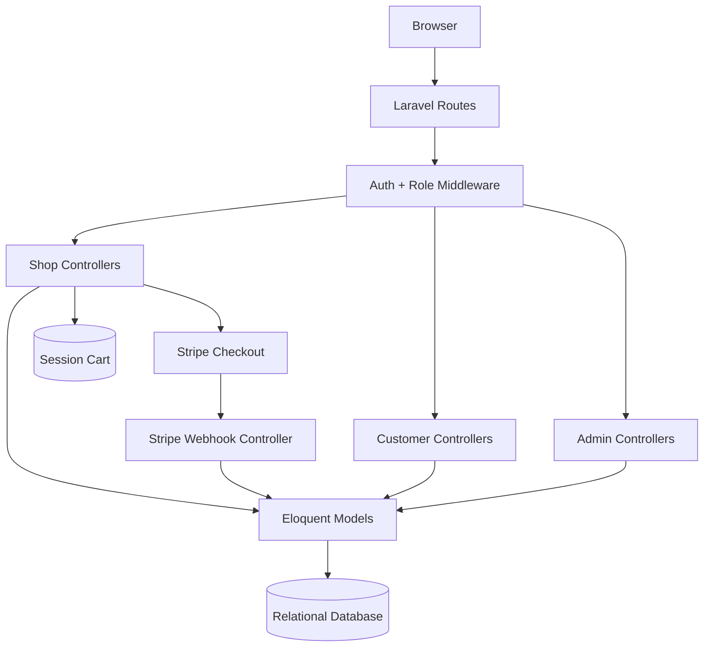
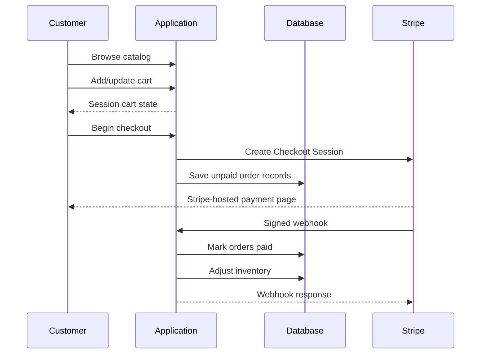

# Boldinone Architecture

## Overview

Boldinone is structured as a Laravel monolith with separate customer, storefront and administration concerns. The application uses Laravel routing/controllers for business workflows, Eloquent-backed persistence, session state for the cart, and Stripe Checkout for payment collection.

## Route boundaries

The current application separates three important access areas:

### Public / storefront

Public routes cover storefront browsing, products, search, cart operations, language switching, product details, categories, about/contact/service content and Stripe webhook reception.

### Authenticated customer

Customer routes are protected with authentication and a `customers` role. They include customer-specific operations such as checkout, wishlist, order history and product reviews.

### Administration

Administration routes are protected with authentication and an `admin` role. Resources include products, orders, roles, permissions, users, categories, promotional slides, advertisements, settings and plans.

This separation is useful because authorization remains visible at the route boundary instead of relying only on UI visibility.

## Commerce lifecycle

## Product and merchandising model

The storefront code supports more than a simple product index. Products can participate in multiple presentation strategies:

- featured products
- trending products
- discounted products
- time-bound deals
- featured categories
- selected navigation/menu categories
- wishlist state per authenticated customer

This is a useful example of how a single catalog can support different business merchandising views without creating separate product stores.

## Payment boundary

Stripe is treated as an external payment provider rather than embedded card-processing logic. The application creates Checkout Sessions and receives signed webhooks for asynchronous confirmation.

Important payment responsibilities are split as follows:

| Responsibility | Application |
|---|---|
| Build checkout line items | Laravel |
| Host card entry | Stripe |
| Verify webhook signature | Laravel + Stripe SDK |
| Persist order state | Laravel database |
| Update stock | Laravel business logic |
| Store payment secrets | Environment variables |

## Frontend

The repository uses Blade with a modern asset pipeline:

- Vite
- Tailwind CSS
- Alpine.js
- Axios

This keeps the project server-rendered while still allowing responsive and interactive UI behavior.

## Production hardening priorities

For a high-volume production deployment, the highest-value next steps are:

1. Add checkout and webhook feature tests.
2. Make webhook processing explicitly idempotent so provider retries cannot repeat inventory mutations.
3. Wrap payment-state and stock updates in database transactions.
4. Move expensive side effects such as notifications to queues.
5. Add structured payment/audit logging.
6. Add policy-level authorization tests for administrator/customer boundaries.
7. Add application-level observability for failed payment callbacks.

These items are documented as engineering priorities rather than hidden because reliable production systems depend on explicit failure-mode thinking.
