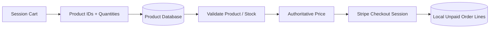
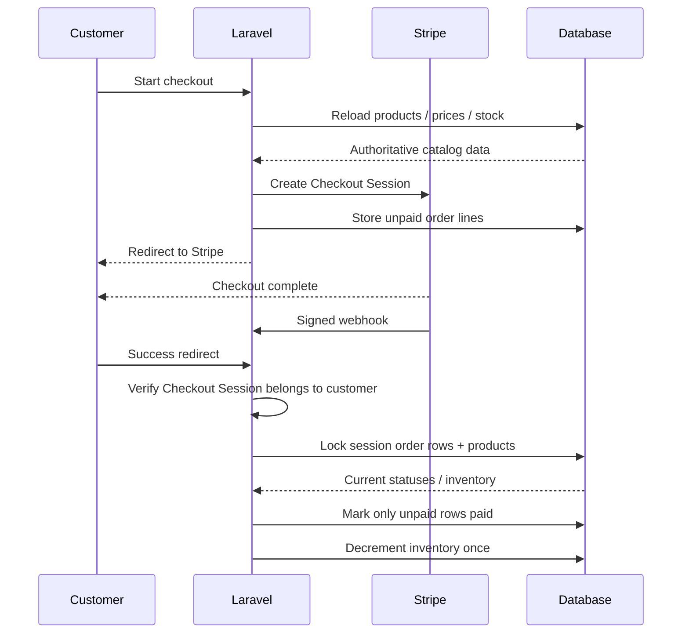

# Stripe Payment Lifecycle

Boldinone treats Stripe Checkout and Stripe webhooks as two parts of the same payment workflow.

## Checkout creation

1. The authenticated customer's cart is read from the Laravel session.
2. Every product is reloaded from the database.
3. Product identity, price and available stock are taken from the database rather than trusted from session values.
4. Prices are converted to Stripe integer minor units (`unit_amount`).
5. A Stripe Checkout Session is created with the authenticated user ID in metadata and `client_reference_id`.
6. Local order lines are persisted as `unpaid` inside a database transaction.
7. The customer is redirected to Stripe-hosted Checkout.



The cart is treated as UX state, not an authoritative financial source.

## Payment confirmation

Payment may be observed through two independent paths:

- Stripe redirects the browser to the success URL.
- Stripe sends a signed webhook such as `checkout.session.completed`.

Either path can arrive first, and Stripe may retry webhooks. For that reason, inventory updates must be idempotent.



## Checkout ownership

The browser success endpoint retrieves the Stripe Checkout Session and verifies its `client_reference_id` or `metadata.user_id` matches the authenticated Laravel user.

Local order queries are additionally scoped to the current user.

This prevents someone who learns another Checkout Session ID from using the success endpoint to view or finalize another customer's order.

## Idempotency strategy

`markSessionPaid()` runs inside a database transaction and locks the order rows for the Stripe Checkout Session.

For every order line:

- if it is already `paid`, no inventory update is performed;
- if it is still `unpaid`, the corresponding product row is locked;
- product existence and available quantity are validated;
- the order is transitioned to `paid` and inventory is decremented once.

This protects against:

- duplicate Stripe events;
- Stripe webhook retries;
- the browser success request racing the webhook;
- a customer refreshing the success page;
- concurrent inventory mutation during payment finalization.

## Webhook verification

The webhook endpoint uses Stripe's signature verification with `STRIPE_WEBHOOK_SECRET` before processing an event.

Invalid payloads or signatures receive HTTP 400. Successfully processed or safely ignored events receive HTTP 200 so Stripe does not retry them indefinitely.

The Laravel webhook route is excluded from CSRF because Stripe cannot provide a Laravel CSRF token; the Stripe signature is the authentication mechanism for that endpoint.

## Secrets

Configure locally through `.env`:

```env
STRIPE_KEY=
STRIPE_SECRET=
STRIPE_WEBHOOK_SECRET=
```

Never commit live Stripe credentials or webhook signing secrets.

## Production evolution

The next production-scale step would be a dedicated payment-event table keyed by Stripe event ID plus reconciliation/alerting for events that repeatedly fail after a successful external charge.
