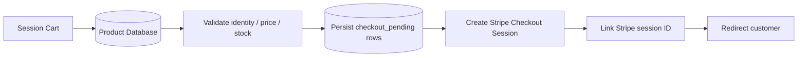
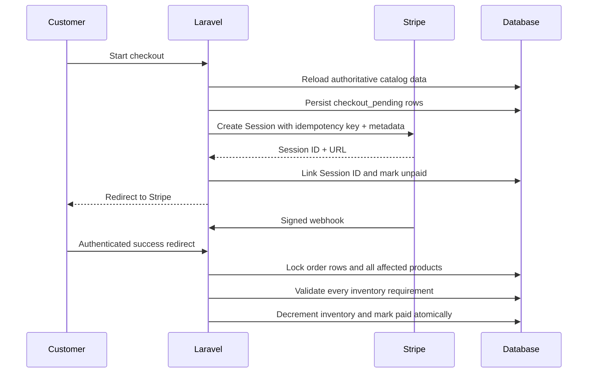

# Stripe Payment Lifecycle

Boldinone treats checkout creation, the browser success redirect, Stripe webhooks, local order rows, and inventory as one recoverable payment workflow.

## Design goals

1. Cart values are never authoritative for product identity, price, or stock.
2. A local checkout record exists before the application calls Stripe.
3. Stripe receives a stable idempotency key for Checkout Session creation.
4. Every webhook event is recorded by Stripe event ID.
5. Payment finalization is atomic and safe to repeat.
6. A paid Stripe session that cannot be reconciled locally returns a non-2xx response so Stripe can retry.

## Checkout creation

1. The authenticated customer's cart is read from the Laravel session.
2. Every product is reloaded from the database.
3. Product identity, price, availability, and stock are taken from the database.
4. Prices are converted to Stripe integer minor units (`unit_amount`).
5. The application generates an internal `checkout_reference` UUID.
6. Local order lines are persisted as `checkout_pending` inside a database transaction.
7. Stripe Checkout is called with:
   - the authenticated user ID in metadata;
   - the internal `checkout_reference` in metadata and `client_reference_id`;
   - an idempotency key derived from the internal checkout reference.
8. The returned Stripe Session ID is linked to the local rows and their state becomes `unpaid`.
9. The customer is redirected to Stripe-hosted Checkout.



The local-first ordering means a network timeout or provider failure leaves an auditable local checkout rather than an unexplained remote request.

## Recovery when the session link is interrupted

A Stripe Session is an external resource, so the remote request and local database update cannot share one database transaction.

If Stripe creates the Session but the subsequent local `session_id` update fails, Stripe still carries `checkout_reference` in metadata. The success redirect or webhook can use that reference to find the pending local rows, attach the real Session ID, and complete reconciliation.

## Payment confirmation

Payment may be observed through two independent paths:

- Stripe redirects the authenticated browser to the success URL.
- Stripe sends a signed webhook such as `checkout.session.completed` or `checkout.session.async_payment_succeeded`.

Either path can arrive first. The finalizer accepts a Stripe Session ID plus the internal checkout reference and performs the same idempotent transition.



## Checkout ownership

The browser success endpoint retrieves the Stripe Checkout Session and verifies `metadata.user_id` against the authenticated Laravel user.

Local order queries are also scoped to the current user. A person who learns another Session ID cannot use the success endpoint to display or finalize another customer's order.

## Atomic finalization

`CheckoutFinalizer` runs inside a database transaction and locks matching order rows.

It then:

1. fails explicitly when no local rows match the Stripe Session or checkout reference;
2. ignores rows already marked `paid`;
3. aggregates the required quantity per product;
4. locks all affected product rows in deterministic ID order;
5. verifies every product exists and every inventory requirement can be met;
6. decrements inventory;
7. marks each unpaid order row paid and records the real Stripe Session ID.

Inventory is not changed until **all** products pass validation. An insufficient item therefore rolls back the entire checkout instead of partially fulfilling a paid order.

## Stripe event ledger

`stripe_webhook_events` uses `stripe_event_id` as a unique key and records:

- event type;
- Checkout Session ID where applicable;
- processing status;
- bounded error text;
- processed timestamp.

A worker/request claims an event under a database lock. A previously processed event returns the `duplicate` state without applying the payment again. A failed reconciliation remains recorded as `failed` and can be retried when Stripe redelivers the event.

## Webhook responses

- Invalid payload or signature: HTTP `400`.
- Successfully processed or safely duplicated event: HTTP `200`.
- Local reconciliation failure: HTTP `500`, asking Stripe to retry.
- Missing webhook configuration: HTTP `500`.

The webhook route is excluded from CSRF because Stripe cannot provide a Laravel CSRF token. Its authentication boundary is Stripe's cryptographic signature over the exact raw request body.

## Tests

The payment suite exercises:

- local checkout persistence before the Stripe SDK call;
- database-authoritative pricing even when cart values are modified;
- auditable local state when remote Checkout creation fails;
- successful multi-line finalization;
- repeated finalization without duplicate stock changes;
- checkout-reference recovery;
- missing local rows;
- full transaction rollback on insufficient inventory;
- Stripe event processing and duplicate delivery suppression;
- failed reconciliation ledger state.

## Required environment values

```env
STRIPE_KEY=pk_test_...
STRIPE_SECRET=sk_test_...
STRIPE_WEBHOOK_SECRET=whsec_...
```

Never commit live Stripe credentials or webhook signing secrets.
