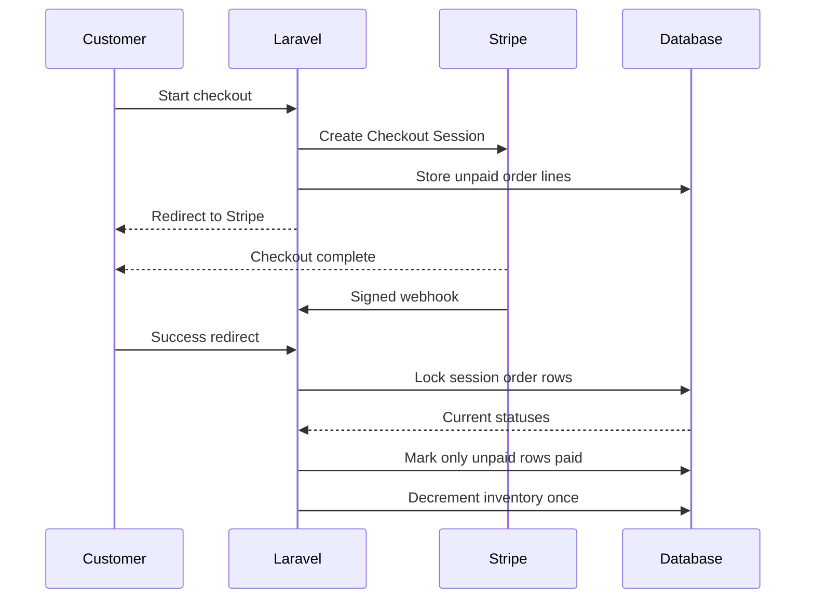

# Stripe Payment Lifecycle

Boldinone treats Stripe Checkout and Stripe webhooks as two parts of the same payment workflow.

## Checkout creation

1. The authenticated customer's cart is read from the Laravel session.
2. Product prices are converted to Stripe integer minor units (`unit_amount`).
3. A Stripe Checkout Session is created with customer and user references.
4. Local order lines are persisted as `unpaid` inside a database transaction.
5. The customer is redirected to Stripe-hosted Checkout.

## Payment confirmation

Payment may be observed through two independent paths:

- Stripe redirects the browser to the success URL.
- Stripe sends a signed webhook such as `checkout.session.completed`.

Either path can arrive first, and Stripe may retry webhooks. For that reason, inventory updates must be idempotent.



## Idempotency strategy

`markSessionPaid()` runs inside a database transaction and locks the order rows for the Stripe Checkout Session.

For every order line:

- if it is already `paid`, no inventory update is performed;
- if it is still `unpaid`, it is transitioned to `paid` and inventory is decremented.

This protects against:

- duplicate Stripe events;
- Stripe webhook retries;
- the browser success request racing the webhook;
- a customer refreshing the success page.

## Webhook verification

The webhook endpoint uses Stripe's signature verification with `STRIPE_WEBHOOK_SECRET` before processing an event.

Invalid payloads or signatures receive HTTP 400. Successfully processed or safely ignored events receive HTTP 200 so Stripe does not retry them indefinitely.

## Secrets

Configure locally through `.env`:

```env
STRIPE_KEY=
STRIPE_SECRET=
STRIPE_WEBHOOK_SECRET=
```

Never commit live Stripe credentials or webhook signing secrets.
